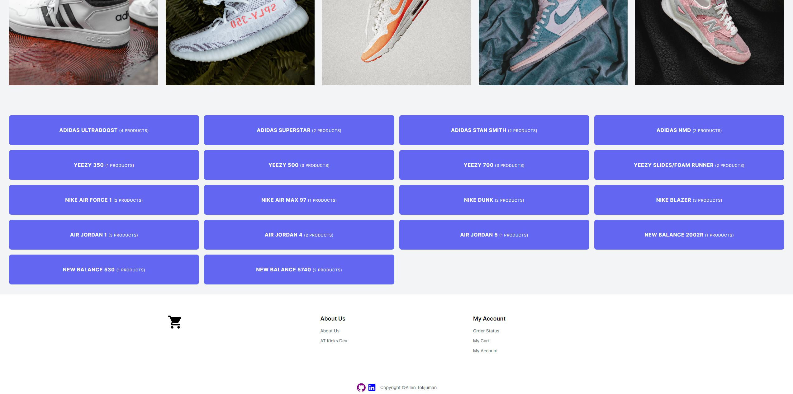
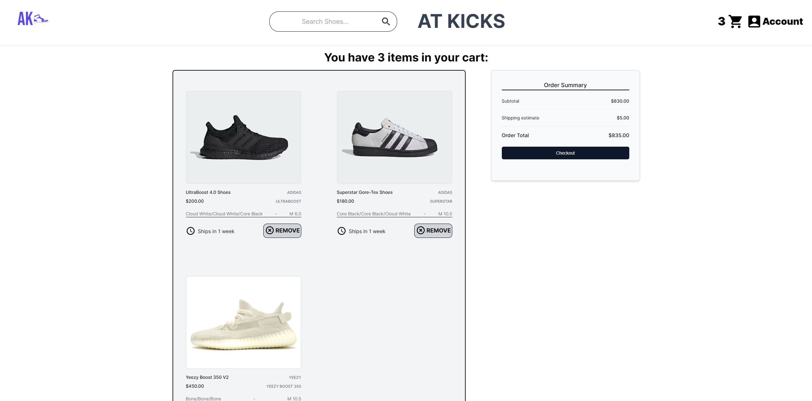

Please visit [https://atkicks.allentok.com](https://atkicks.allentok.com) to enter ATKicks!

This app was created and bootstrapped by NextJS using NextJS v13.0 with the /app router. Please refer to https://github.com/allthetok/ECommerce to see the ExpressJS/Postgres/Caddy Dockerized REST API Container to serve API calls made here.

Frameworks and Libraries Used:

- NextJS v13.0 using the /app router, Server Components (getServerSideProps see /Components/Server) and Client Components (see /Components). Custom layout files for authentication based routes and main app routes for Navbar and Footer. Using the fetch API to retrieve data from the Dockerized ExpressJS, Postgres and Caddy container.
- ReactJS v18.2.0 with ES6 Arrow Function Components, Custom Hooks (see /hooks) and Standard React Hooks (useState, useEffect, useCallback, useMemo, useContext). As well as Custom Context Providers for Stripe Cart Items, and Authentication from NextAuth.
- Stripe for payment authorization in TEST mode (enter 42* when checking out) with custom Stripe checkout pages, which processes payments based on a user's profile info, provides analytics and custom handlers for tracking payments and sends Stripe invoices to user's emails upon successful checkout: see src/app/success. useShoppingCart hook from Stripe was also largely used for handling Cart state around the app.
- NextAuth with internal Authentication as well as OAuth2.0 integration on: Google, Spotify, Discord, Github, Twitch. Using the /app wrapper for requests, and getServerSession() hook for use in server components.
- TypeScript (Interfaces/Types/Unions) for props, response from REST api and in use for functions, Component props, normalizing internal database with Stripe Checkout types and normalizing a User Sesssion object with NextAuth through native authentication or an OAuth provider. 
- ESLint with Typescript Integration
- MaterialUI V5 with sx prop styling.
- TailwindCSS V3.4.1 used for lightweight bundling and fast, in-depth styling. As well as responsive design for any screen size.
- Toast for custom notifications when adding and removing cart items as well as navigation to cart details, see src/app/cart.
- Axios
- CSS Component Stylesheets (Flexbox and Grid) for more detailed css attributes that are necessary (linear gradients, custom background images).
- Icons8 for Static Assets

Here are some screenshots from the web app:

